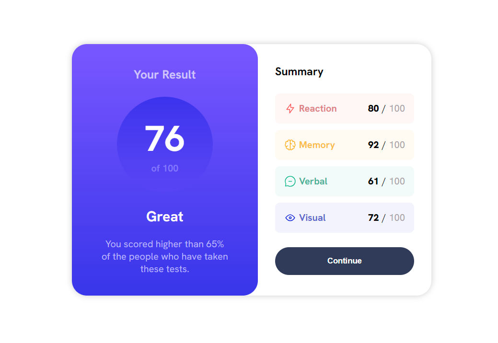
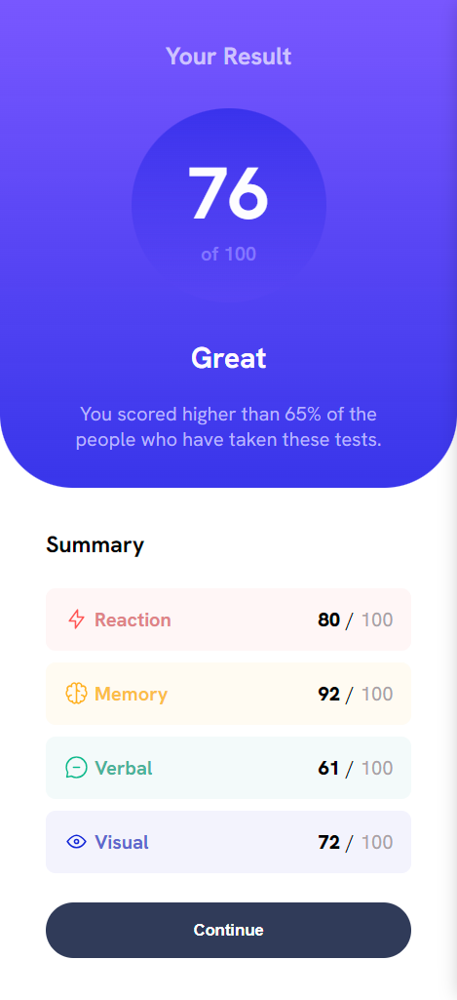

# Frontend Mentor - Results summary component solution

This is a solution to the [Results summary component challenge on Frontend Mentor](https://www.frontendmentor.io/challenges/results-summary-component-CE_K6s0maV).

## Screenshots

### Desktop

### Mobile

## Built with

- Semantic HTML5 markup
- Flexbox
- Javascript

## Author

- Portfolio - [hakanokay.dev](https://hakanokay.dev/)
- Frontend Mentor - [@h-okay](https://www.frontendmentor.io/profile/h-okay)
